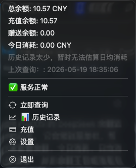
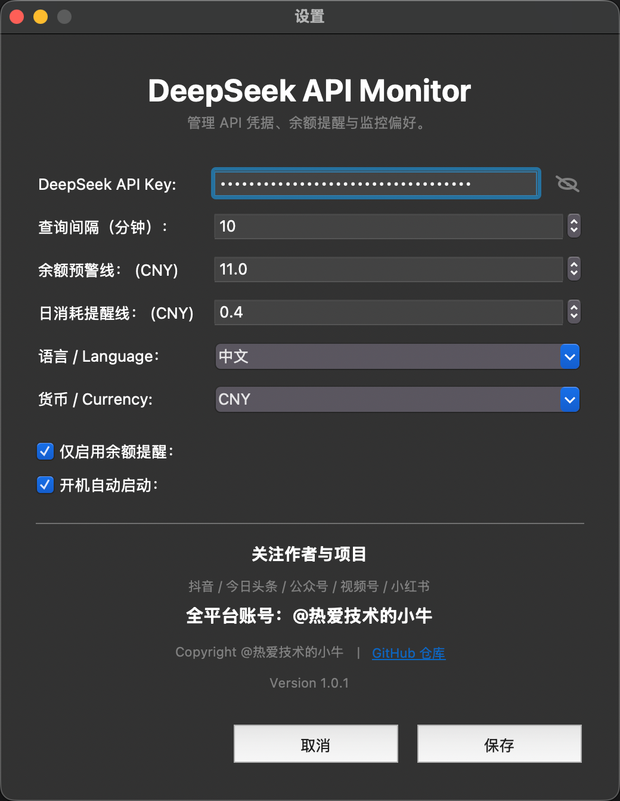
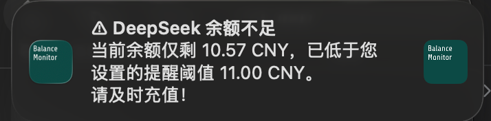

# DeepSeek Balance Monitor for Mac

一个面向 macOS 的 DeepSeek 余额监控菜单栏应用。

它会常驻菜单栏，帮助你快速查看余额、今日消耗、日均消耗和服务状态，并在余额不足或消耗异常时提醒你。

[下载最新版本](https://github.com/github653224/DeepSeekBalanceMonitorForMac/releases/latest)

[PyPI 项目页](https://pypi.org/project/deepseek-balance-monitor-mac/)

## 项目定位

- mac 原生菜单栏应用
- 原生设置窗口
- 原生历史记录窗口
- 支持源码运行
- 支持打包 `.app`
- 支持打包 `.dmg`

当前仓库聚焦 mac 产品线，后续优先围绕 mac 版本持续演进。

## 主要功能

- 查询 DeepSeek API 余额
- 显示人民币 / 美元余额
- 显示今日消耗
- 显示日均消耗
- 显示服务状态
- 低余额提醒
- 今日消耗阈值提醒
- 本地 SQLite 历史记录
- CSV 导出
- 本地安全存储 API Key

## 界面预览

菜单栏主界面：



设置窗口：



低余额提醒：



## 为什么值得用

- 菜单栏常驻，打开电脑就能看到余额状态
- 不用反复打开网页，查询路径更短
- 支持低余额阈值提醒和日消耗提醒
- 支持历史记录沉淀，方便回看消耗变化
- 支持本地运行、`.app` 分发和 `.dmg` 安装
- 支持通过 PyPI 安装
- 已开源，可自行审查代码和二次开发

## 你应该怎么安装

如果你是普通 mac 用户，推荐直接下载 `.dmg` 安装包。

如果你已经有 Python 环境，或者希望通过命令行安装和更新，推荐使用 PyPI。

如果你打算参与开发或二次修改，推荐直接拉源码运行。

## 下载与安装

### 方式一：普通用户安装

普通用户建议直接前往 GitHub Releases 下载：

- `.dmg`：适合 mac 用户安装使用
- `.zip`：适合手动解压体验

下载地址：

- [GitHub Releases](https://github.com/github653224/DeepSeekBalanceMonitorForMac/releases)

安装后首次打开时：

- 如果还没有配置 API Key，应用会自动引导你打开设置窗口
- 配好 API Key 后，应用会常驻在菜单栏

### 方式二：通过 PyPI 安装

适合：

- 已经有 Python 环境的开发者
- 想通过 `pip` 直接安装和更新的人

安装命令：

```bash
pip install deepseek-balance-monitor-mac
```

如果你使用 conda 或虚拟环境，建议先激活环境后再安装。

安装完成后可以这样启动：

```bash
deepseek-balance-monitor
```

也可以这样启动：

```bash
python -m deepseek_balance_monitor_mac
```

PyPI 地址：

- [deepseek-balance-monitor-mac on PyPI](https://pypi.org/project/deepseek-balance-monitor-mac/)

### 方式三：源码运行

适合：

- 想调试代码
- 想自己修改功能
- 想参与开发贡献

## 快速开始

建议先准备好 Python 3.11+ 环境，再安装项目依赖。

```bash
cd /path/to/DeepSeekBalanceMonitorForMac
uv pip install -e '.[build]'
python main.py
```

也可以这样启动：

```bash
python -m deepseek_balance_monitor_mac
```

源码方式下也可以直接执行项目脚本：

```bash
deepseek-balance-monitor
```

## 常用开发命令

运行应用：

```bash
python main.py
```

运行测试：

```bash
python -m unittest tests.test_core
```

检查关键入口是否可编译：

```bash
python -m py_compile \
  main.py \
  src/deepseek_balance_monitor_mac/mac/main.py \
  src/deepseek_balance_monitor_mac/mac/settings.py
```

## 打包命令

打包 `.app`：

```bash
bash scripts/build_mac.sh
```

打包 `.dmg`：

```bash
bash scripts/build_dmg.sh
```

## 项目结构

```text
DeepSeekBalanceMonitorForMac/
  main.py
  pyproject.toml
  README.md
  docs/
  scripts/
  src/
    deepseek_balance_monitor_mac/
      core/
      infra/
      mac/
      assets/
  tests/
```

更多公开说明见：

- [贡献指南](CONTRIBUTING.md)
- [安全说明](SECURITY.md)

## 常见问题

### 1. 为什么只配置 API Key 就能用

因为这个工具不是网页登录型应用，而是直接调用 DeepSeek 的余额接口。

它通过请求头里的 `Authorization: Bearer <API_KEY>` 完成鉴权，所以不需要浏览器登录流程。

### 2. 普通用户应该选哪种安装方式

推荐直接下载 `.dmg`。

这样不需要自己准备 Python 环境，安装和使用会更顺手。

### 3. PyPI 安装适合谁

更适合已经有 Python 环境的开发者，或者希望通过 `pip` 管理安装与升级的人。

### 4. PyPI 安装后怎么启动

安装完成后直接执行：

```bash
deepseek-balance-monitor
```

或者：

```bash
python -m deepseek_balance_monitor_mac
```

## 开源前建议

- 确认代码和文档里没有真实 API Key
- 不提交 `build/`、`dist/`、`*.egg-info/`、`__pycache__/`
- 检查截图和示例数据中是否包含隐私信息
- 推送前先完成一次基础测试和打包验证

## 许可证

本项目使用 MIT License。
